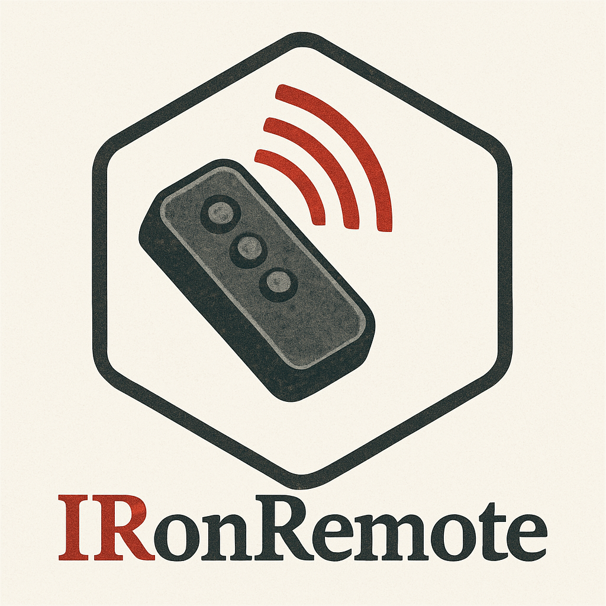

<!-- LOGO -->
<h1>
<p align="center">
    
    <br>IRonRemote
</p>
</h1>
<p align="center">
    <b>An infrared remote, written in Rust, packaged in Nix, and developed for the Pinenut-01S</b>
    <br />
    <a href="#about">About</a>
    .
    <a href="#installation">Installation</a>
    .
    <a href="#usage">Usage</a>
    .
    <a href="#contributing">Contributing</a>
</p>

## About
> ***As of 2025-04-02 this is just an empty repository with the majority of the development environment defined. No work on the software product has been conducted yet.***

The most important question anyone will ask, "*Why is the repo called IRonRemote*"? The answer is of course a pun! This is an infrared remote control built in Rust. Therefore IR + iron = IRon, and it's a remote...IRonRemote.

## Installation
### Build From Source
#### Dependencies
- Rust Toolchain (cargo, rustc)
- Rust Targets (riscv32imafc-unknown-none-elf, x86_64-unknown-none/aarch64-unknown-none)
### Build via Nix
Compilation via Nix can be performed for either the target hardware, or the build host:

`host:`
```sh
nix build .#native
```
`target:`
```sh
nix build
```

Use the `cargo-binutils` utility `objcopy` to change the ELF into the binary:
```
cargo objcopy --release -- -O result/bin/IRonRemote firmware.bin
```

Then finally, use the blflash utility to flash the target:
```
blflash flash firmware.bin --initial-baud-rate 115200 --baud-rate 115200 --port /dev/{TBD}
```
## Usage
## Contributing
See the documentation for [installation](#installation), which includes instructions for building from source or building via Nix.

Additionally Nix users can make use of the development environment included in the repository by executiing:
```sh
nix develop
```
